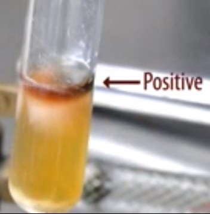
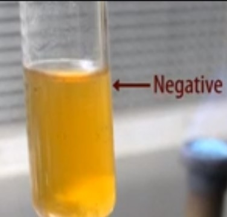

### Materials Required:
 
&nbsp;

### Culture:
 

24-48 hour tryptic soy broth culture.

&nbsp;

 

### Media:
 

MR-VP medium

 
&nbsp;

### Media preparation:
 

Weigh 5 g of glucose, 5 g of peptone and 5 g of dipotassium hydrogen phosphate separately. Suspend all the ingredients in distilled water. Make up to 1000 ml. pH should be 6.9. Dispense 3 ml of the media into each test tube, which are plugged and sterilized at 121°C

&nbsp;
 

### Reagents:
 

Barritt's reagents A and B.

 
&nbsp;

### Preparation of Barritt's reagent:
 

It consists of two solutions;

 

1. Solution A is prepared by dissolving 6 grams of a-naphtholin in 100 ml of 95% ethyl alcohol.

2. Solution B is prepared by dissolving 16 grams of potassium hydroxide in 100 ml of water.
 
&nbsp;

### Equipments:
 

Bunsen burner.
Inoculating loop.

&nbsp;

## Procedure:

&nbsp;

Using sterile technique, inoculate each experimental organism to the appropriately labeled tube of medium by means of loop inoculation. Incubate the cultures for 24-48 hours at 37°C. The experiment should be conducted in the LAF. Arrange the materials required for the experiment in the LAF.

&nbsp;
 

1. Sterilize the loop vertically in the blue flame of the Bunsen burner till red hot. Heat from the base of the wire first and slowly move towards the loop (tip). Heat the wire until it is red-hot.

2. From the rack, take the test tube containing the Tryptic Soy Broth(TSB) cultures that has been kept for 24 - 48 hours.

3. Remove the cap from the TSB tube and flame the neck of the tube.

4. Using aseptic technique take a loop full of the organism from the TSB (tryptic soy broth).

5. Again flame the neck of the tube and replace the cap and place the tube in the test tube rack.

6. Take two sterile MR-VP broth tubes, one named Test and the other Control.

7. Remove the cap of  the MR-VP broth tube named 'Test' and flame the neck of the tube.

8. Inoculate the MR-VP broth with the inoculation loop containing the inoculum from the TSB.

9. Again flame the neck of the MR-VP tube and place it in the test tube rack. Inoculate only the broth in the tube named 'Test' using aseptic technique. Leave the broth in the tube named 'Control' uninoculated.

10. Incubate both the tubes (Test and  Control) for 24 to 48 hours at 37°C.

11. Remove the broths from the incubator.

12. Remove the cap and add 10 drops of Barritt's A reagent and 10 drops of Barritt's B reagent to each broth.

13. Shake gently for several minutes.

14. Red color formation within 15 to 20 minutes is a positive result. No red color formation after 15 to 20 minutes is a negative result.
 

&nbsp;

### Positive Result:
 

Glucose ------Glucose Metabolism-------> Pyruvic Acid.

Pyruvic acid ---------------> Acetoin.

Acetoin + added alpha-naphthol + added KOH = red color.

 

 
 
&nbsp;

### Negative Result:
 

Glucose ------Glucose Metabolism-------> Pyruvic Acid.

Pyruvic acid -----------------> No Acetoin.

No acetoin + added alpha-naphthol + added KOH = copper color.

 

  

 

&nbsp;

 ### Real Lab Scenarios:
 

When negative tests are obtained, another method should be used to confirm the results. An inexperienced individual may, at first, fail to recognize the color change which occasionally develops with some weakly positive strains unless a negative control is used for comparison. With either method, a positive reaction appears to be quite reliable but an occasional false negative is possible with a few organisms. You should observe the tube for up to 20 minutes before determining a result for VP.

&nbsp;

### Limitations:
 

1. Results of the MR and VP tests need to be used in conjunction with other biochemical tests to differentiate genus and species within the Enterobacteriaceae.

2. A precipitate may form in the potassium hydroxide reagent solution. This precipitate has not been shown to reduce the effectiveness of the reagent.

3. Most members of the family Enterobacteriaceae give either a positive MR test or a positive VP test. However, certain organisms such as Hafnia alvei and Proteus mirabilis may give a positive result for both tests.

4. Read the VP test at 48 hours. Increased incubation may produce acid conditions in the broth that will interfere with the readings of the results.

5. VP reagents must be added in the order and the amounts specified or a weak-positive or false-negative reaction may occur. A weak-positive reaction may be masked by a copper-like color which may form due to the reaction of KOH and a-naphthol.

6. Read the VP test within 1 hour of adding the reagents. The KOH and a-naphthol may react to form a copper-like color, causing a potential false-positive interpretation.

7. Due to the possible presence of acetoin, diacetyl or related substances in certain raw materials, the use of media low in these substances (such as MR-VP media) is recommended for this test.