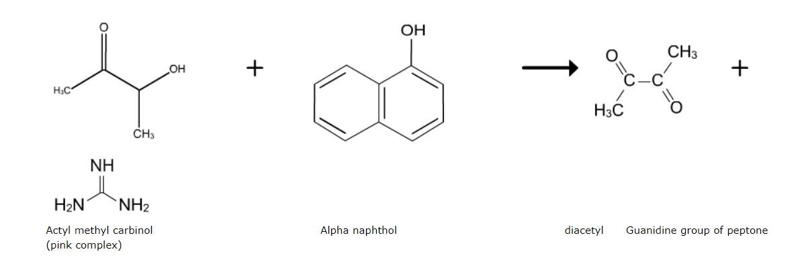

### Principle:
 

Differentiation of the principal groups of Enterobacteriaceae can be accomplished on the basis of their biochemical properties and enzymatic reactions in the presence of specific substrates. The IMViC series of tests (indole, methyl red, voges-proskauer, and citrate utilization )can be used. The enteric organisms are subdivided as lactose fermenters and nonfermenters. Escherichia coli, Enterobacter aerogenes, Klebsiella pneumoniae are lactose fermenters. Salmonella typhimurium, Shigella dysenteriae, Proteus vulgaris, Pseudomonas aeruginosa, Alcaligenes faecalis etc are non lactose fermenters. The Voges-Proskauer (VP) test has found wide acceptance in clinical laboratories as a means of classifying strains of Enterobacteriaceae, based on acetoin production.

 

The Voges-Proskauer test determines the capability of some organisms to produce non acidic or neutral end products, such as acetyl methyl carbinol, from the organic acids that result from glucose metabolism.

 

The reagent used in this test is Barritt's reagent, consists of a mixture of alcoholic a-naphthol and 40% potassium hydroxide solution. Detection of acetyl methyl carbinol requires this end product to be oxidized to a diacety compound. This reaction will occur in the presence of the a-naphthol catalyst and a guanidine group that is present in the peptone of the MR-VP medium. As a result, a pink complex is formed, imparting a rose color to the medium. Development of a deep rose color in the culture 15 minutes following the addition of Barritt's reagent is indicative of the presence of acetyl methyl carbinol and represents a positive result. The absence of rose color is a negative result.

 